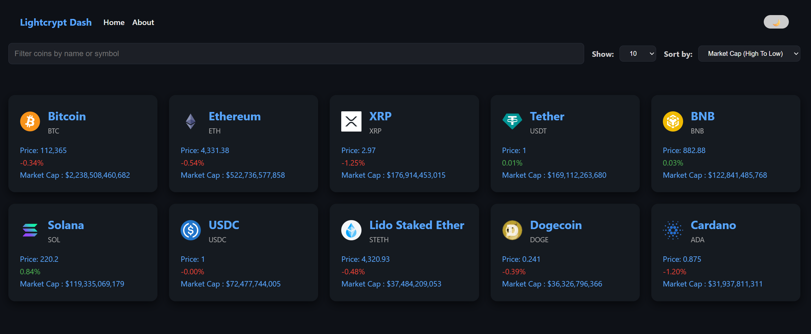
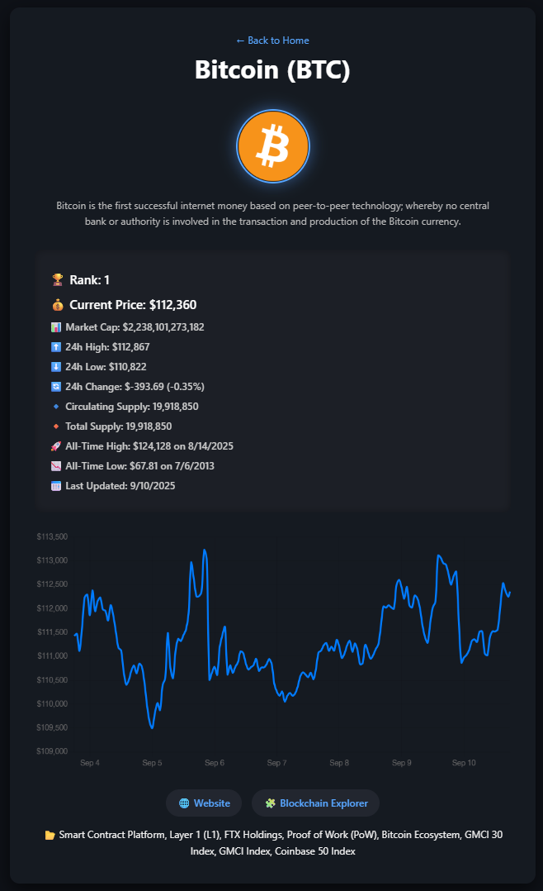

 `README.md`.
---

````markdown
# 💹 Lightcrypt Dash

A simple yet powerful **Cryptocurrency Tracker Dashboard** built with **React**.  
It fetches real-time data from the [CoinGecko API](https://www.coingecko.com/en/api) and provides features like filtering, sorting, dark/light theme, and detailed coin pages.

---

## ✨ Features

- 🔎 Filter coins by name or symbol (e.g., BTC, ETH)
- ↕️ Sort coins by:
  - Market Cap (asc/desc)
  - Price (asc/desc)
  - 24h Price Change %
- 📊 Limit results with a coin count selector
- 🌗 Dark/Light Theme Toggle
- 📄 Coin Details Page for more information
- 🧭 Routing support:
  - `/` → Home Dashboard
  - `/coin/:id` → Coin details
  - `/about` → About project
  - `*` → 404 Not Found Page

---

## 🛠️ Tech Stack

- ⚛️ [React](https://reactjs.org/) (Hooks & React Router)
- 🎨 Custom CSS (Dark/Light theme)
- 🌐 [CoinGecko API](https://www.coingecko.com/en/api)
- 🚀 Vite (or Create React App)

---

## 📦 Installation & Setup

```bash
# Clone repository
git clone https://github.com/your-username/lightcrypt-dash.git
cd lightcrypt-dash

# Install dependencies
npm install

# Run development server
npm run dev
````

Open [http://localhost:5173](http://localhost:5173) (Vite) or [http://localhost:3000](http://localhost:3000) (CRA).

---

## 🔌 API Usage

This project uses the **CoinGecko Markets API**:

```
https://api.coingecko.com/api/v3/coins/markets
?vs_currency=usd
&order=market_cap_desc
&per_page=10
&page=1
&sparkline=false
```

Parameters:

* `vs_currency` → Target currency (default: USD)
* `order` → Sort by market cap or price
* `per_page` → Number of coins to fetch
* `page` → Pagination
* `sparkline` → Fetch sparkline data or not

---

## 📂 Project Structure

```
src/
├── components/
│   ├── CoinCard.jsx
│   ├── FilterInput.jsx
│   ├── LimitSelector.jsx
│   ├── SortSelector.jsx
│   ├── Spinner.jsx
│   └── Header.jsx
├── pages/
│   ├── home.jsx
│   ├── about.jsx
│   ├── coin-details.jsx
│   └── not-found.jsx
├── App.jsx
└── main.jsx
```

---

## 🖼️ Screenshots

### Home Dashboard

*Filtering, sorting, and theme toggle*



### Coin Details Page



---

## 🚀 Deployment

Deploy easily with:

* [Vercel](https://vercel.com)
* [Netlify](https://netlify.com)
* GitHub Pages

Example (Vercel):

```bash
npm run build
vercel deploy
```

---

## 👨‍💻 Author

**Jeshaiah Jesse**
Full Stack Developer

* 🌐 [GitHub](https://github.com/Jeshaiah73)
* 💌 Email: [jedrac46@gmail.com](mailto:jedrac46@gmail.com)

---

```